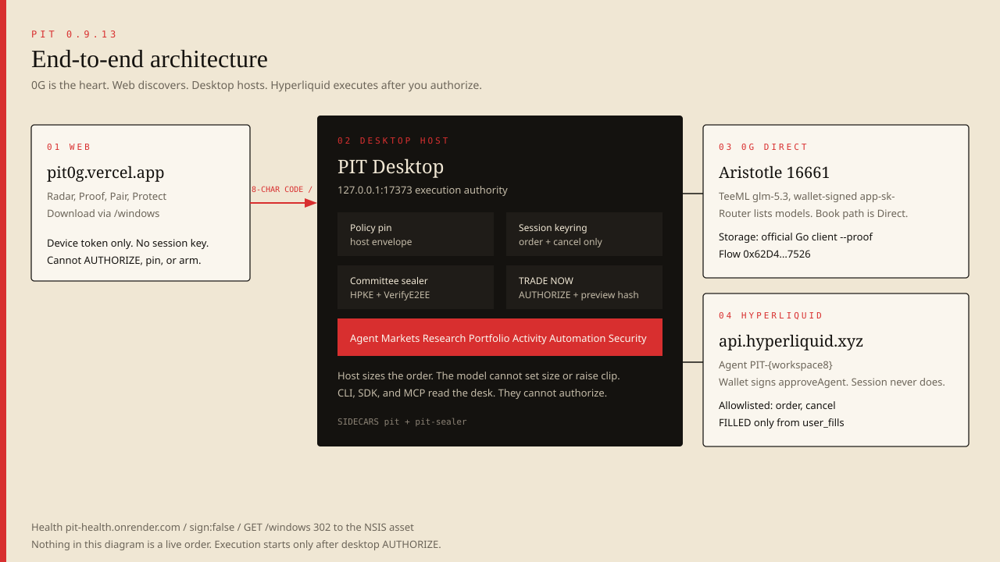
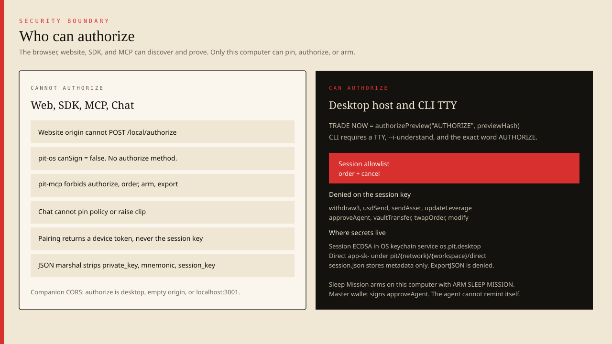
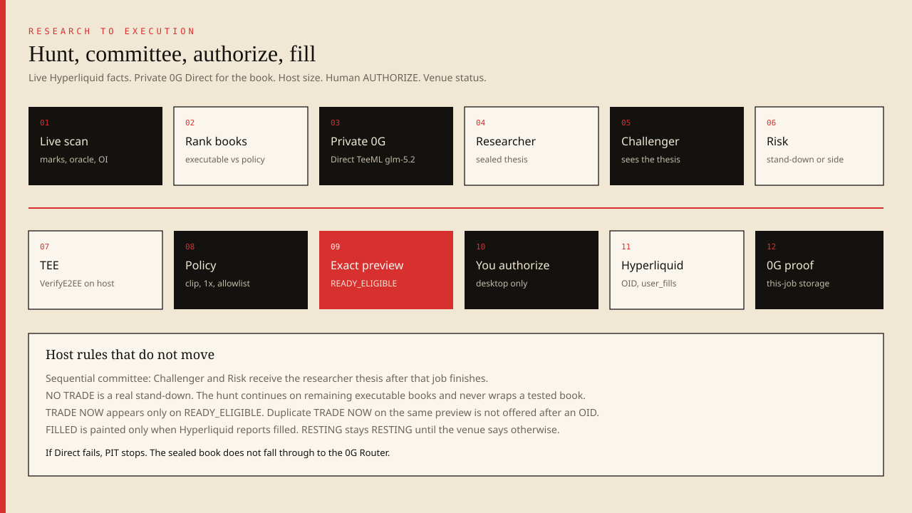
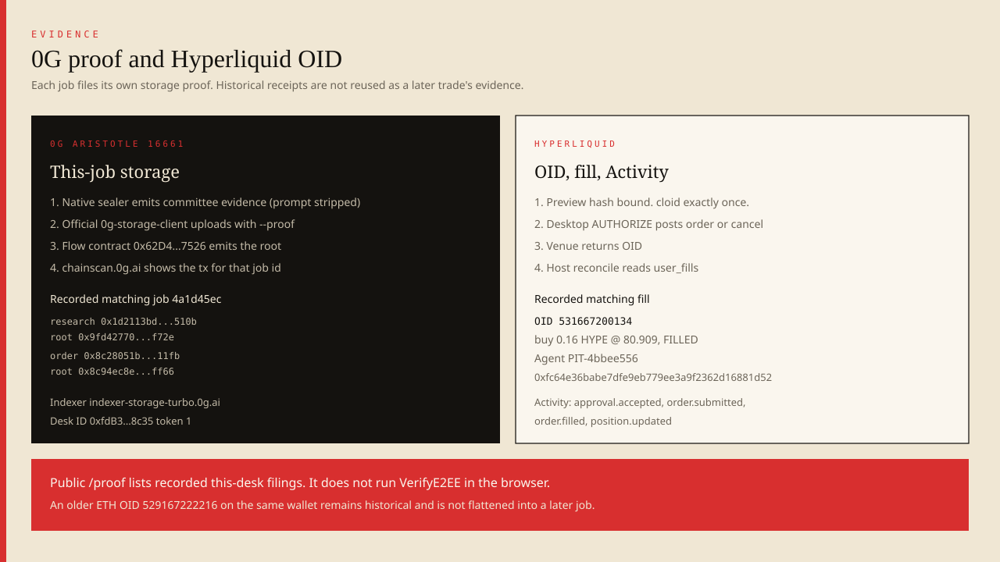

# PIT

PIT is a private trading desk that seals your book into 0G Direct TeeML, runs a sequential researcher → challenger → risk committee, and sizes the order on the **host**. The model cannot set size. You confirm an exact preview on this computer. A Sleep Mission is optional bounded host execution and only arms here. The web discovers and proves. The desktop protects and acts.

**Product 0.9.13** · [pit0g.vercel.app](https://pit0g.vercel.app) · [health](https://pit-health.onrender.com/health) (`sign: false`) · [Windows installer](https://pit-health.onrender.com/windows)

## Watch the product

[https://youtu.be/zYgxDTI7jIk](https://youtu.be/zYgxDTI7jIk) · local `edit/PIT-launch.mp4`

**Pair → Protect → Connect Hyperliquid → Pin Policy → Agent → live scan → private 0G → committee → exact preview → AUTHORIZE → Hyperliquid OID → 0G proof → Activity → Sleep Mission.**

## Core idea

A public chat API leaks a book. A withdraw key empties an account. PIT splits the job: Direct TeeML for the book, host for size and policy, Hyperliquid session for `order` and `cancel` only. The sealed prompt never enters Vercel, MCP, or `pit-os`.

## Journey

1. Download [PIT Desktop](https://pit-health.onrender.com/windows). Companion `127.0.0.1:17373`.
2. **Pair** with an 8-character code (2 min). Device token only.
3. **Protect my strategy.** Direct `app-sk-` stays in the OS keychain.
4. **Connect Hyperliquid.** Local agent `PIT-{workspace8}`. Master wallet signs `approveAgent`. Session cannot.
5. **Pin policy** on Security. Chat cannot pin. Re-pin stays available.
6. **Agent:** Find the best / long / short / What can I trade now?
7. Live Hyperliquid scan, rank executable books, private 0G per remaining book.
8. READY preview or named NO TRADE. TRADE NOW only on `READY_ELIGIBLE`.
9. `authorizePreview("AUTHORIZE", previewHash)` on this computer.
10. OID. FILLED only from `user_fills`. This-job 0G Storage `--proof`.
11. **Activity** is the ledger. **Portfolio** is the venue. Sleep Mission optional.

Researcher proposes a side from live facts. Challenger receives `researcher_thesis`. Risk follows. Native sealer VerifyE2EE. Host clip cannot be raised by the model.

## 0G Direct

Aristotle `16661`. glm-5.2 TeeML. HPKE + `VerifyE2EE` in `pit-sealer`. Router lists models; the sealed book never uses it. If Direct fails, PIT stops. Researcher, Challenger, and Risk run as sequential sealed roles with independent envelopes.

- Provider `0x7DCFe6AEa70350C2090041524c9B4A9262DCe87D`
- teeSigner `0xA46EA4FC5889AD35A1487e1Ed04dCcfa872146B9`
- Serving `0x47340d900bdFec2BD393c626E12ea0656F938d84` · Ledger `0x2dE54c845Cd948B72D2e32e39586fe89607074E3`
- Flow [`0x62D4144dB0F0a6fBBaeb6296c785C71B3D57C526`](https://chainscan.0g.ai/address/0x62D4144dB0F0a6fBBaeb6296c785C71B3D57C526)

## Hyperliquid

Agent **PIT-4bbee556** `0xfc64e36babe7dfe9eb779ee3a9f2362d16881d52`. Allowlist: `order`, `cancel`. Denied: withdraw, leverage, `approveAgent`, transfers. Host sizes. Clip $13, 1x on the recorded desk.

## Authorization

Desktop TRADE NOW and CLI TTY `AUTHORIZE` only. Web, `pit-os`, `pit-mcp`, and chat cannot pin, authorize, arm, or export. Session ECDSA in keychain `os.pit.desktop`. Companion JSON strips `private_key`, mnemonic, and `session_key`. Preview hash binding. Exactly-once `cloid`. Duplicate TRADE NOW is not offered after that preview's OID.

## Sleep Mission

Optional. Arms on this computer with `ARM SLEEP MISSION` while the machine stays awake. Chat, web, SDK, and MCP cannot arm it.

## Surfaces

Web: Radar, Proof, Pair, Protect, download. Desktop: Desk, Agent, Markets, Research, Portfolio, Activity, Automation, Health, Security. CLI, `pit-os@0.9.11`, `pit-mcp@0.9.12` are read-only. MCP tools: health, watch, release, companion, status, activity, positions, research_status, proofs, security. Wallet `0xbdfcee82bd42fefa58ee850b3709636a8b6b0034`.

## Contracts

Desk ID [`0xfdB3a8D39F1E2b77a8261b359eABaaa2F08f8c35`](https://chainscan.0g.ai/address/0xfdB3a8D39F1E2b77a8261b359eABaaa2F08f8c35) ERC-7857 `0x2afbede9` / `0xdf597d99` / `0x74f8628b`. ERC-8004 Identity [`0x8004A169FB4a3325136EB29fA0ceB6D2e539a432`](https://chainscan.0g.ai/address/0x8004A169FB4a3325136EB29fA0ceB6D2e539a432) agentId **3489333** [register](https://chainscan.0g.ai/tx/0xa2f67529745a662163b84fe10f855a3aa25596f9bc4d4c604d2abefbc3f3ff7d).

## Proof (job `4a1d45ec`)

- Research [0x1d2113bd…](https://chainscan.0g.ai/tx/0x1d2113bd683b3ef8be5d74d603018c4bacdd49531bdf201abbc7dea4bb16510b) root `0x9fd42770545ecaacbfff12e3ef7a537b564e31c9ef5515b3a820fd276c22f72e`
- Order [0x8c28051b…](https://chainscan.0g.ai/tx/0x8c28051bec7bebd7af3b6cc75f7aa034d67f9809f9c30eef9a6c9f84ed6c11fb) root `0x8c94ec8e643c90fe69276ff20f50a0bc3121f007d611e10e6ab9f24d26f2ff66`
- Hyperliquid OID **531667200134** buy 0.16 HYPE @ 80.909, **FILLED**
- Preview `0xb273d0052fe389b5e5ad3aad4b176e1cc993b8d8e605716bab78c70f3814e401`

Each job files its own storage proof. Historical ETH OID `529167222216` on this wallet is not flattened into a later job.

## Tests

Go **654 PASS**. Sealer **6 PASS**. Foundry **26 PASS**. Playwright **30 PASS**. `pit-os` **2**. `pit-mcp` **3**. Desktop `npx tsx e2e/run.ts` **PASS**. CI [success](https://github.com/mohamedwael201193/pit/actions/runs/33413773180). Tag `v0.9.13` commit `e431e3b`.

## Download

[https://pit-health.onrender.com/windows](https://pit-health.onrender.com/windows) files `PIT_0.9.13_x64-setup.exe`. SHA256 `B905B9ED167513757D4947BDE61103EB10ECD4A5F76554FE369F205DF3850B1E`. Pair at [/pair](https://pit0g.vercel.app/pair). Stay on MAINNET. Approve the printed PIT Agent on Hyperliquid. TRADE NOW stays on this computer.
