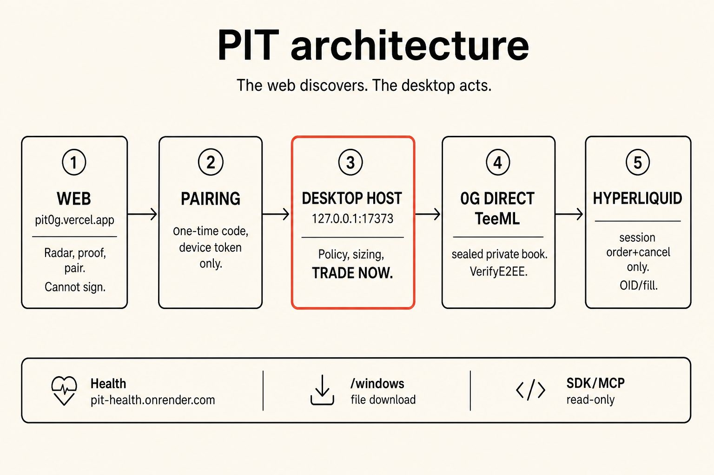
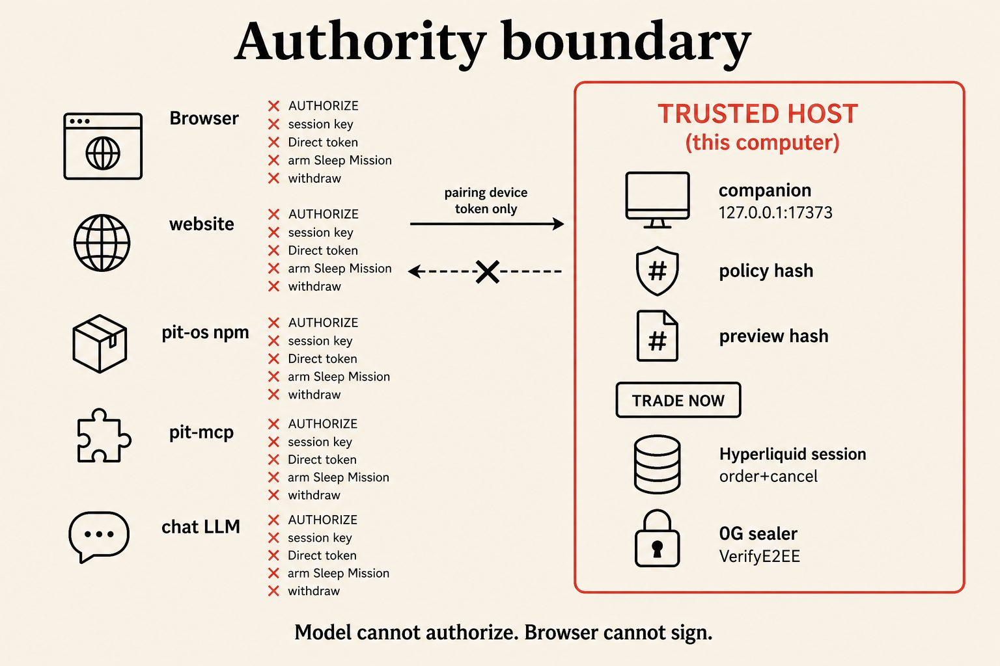
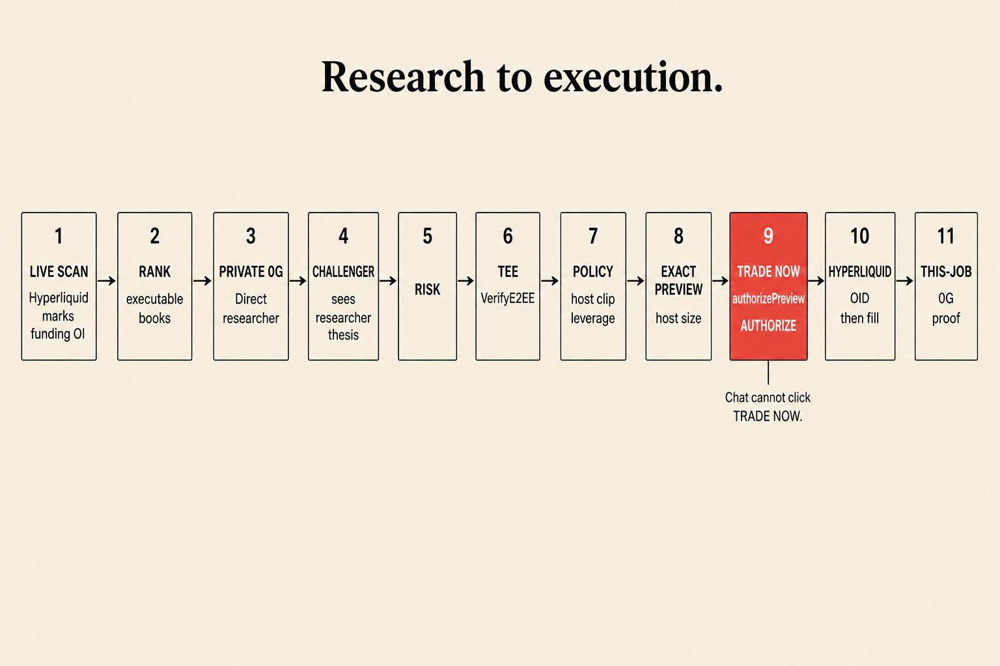
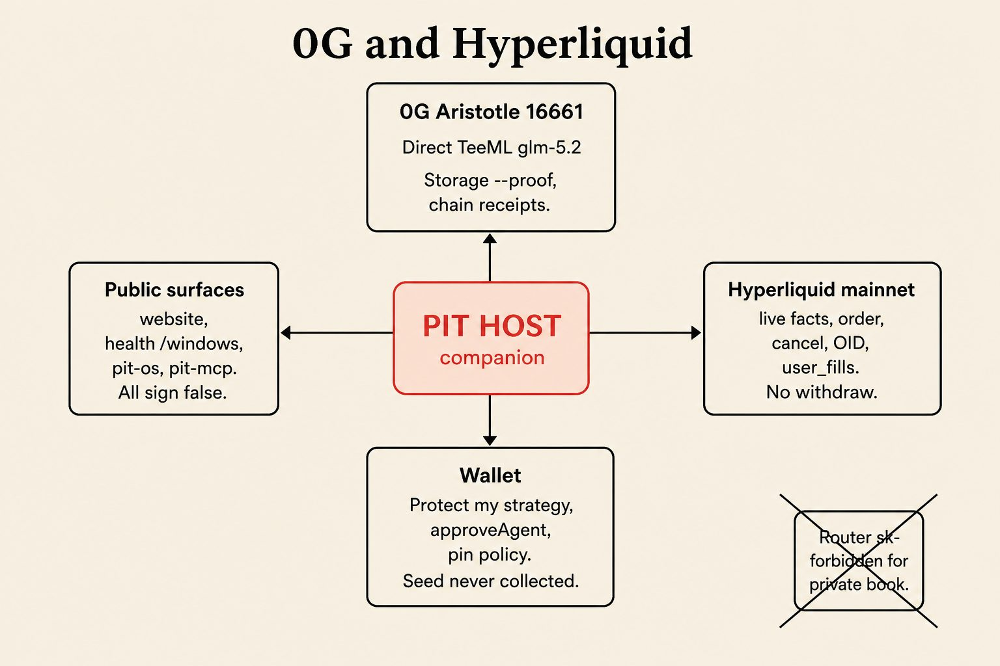

# PIT

PIT is a private trading desk for 0G and Hyperliquid. It seals your book into 0G Direct TeeML, runs a sequential researcher → challenger → risk committee, and sizes the order on the **host**. The model cannot set size. Manual trading requires you to confirm an exact preview on this computer. A Sleep Mission is optional bounded host execution and only arms from this computer.

The web discovers and proves. The desktop protects and acts.



---

## The problem

Pasting a trading book into a public chat API leaks alpha. Giving a bot a withdraw key is how accounts die.

PIT splits the job:

| Layer | What it does | What it cannot do |
|---|---|---|
| Your wallet | Connect, bind, mint Desk ID, pin policy | Never collected as a seed |
| 0G Direct TeeML | Sealed inference over the private book + public market | Router `sk-` path is forbidden for the book |
| Host engine | Size, policy, preview hash, kill switch | LLM JSON cannot raise clip or leverage |
| Your session | Hyperliquid `order` and `cancel` | Withdraw, leverage change, `approveAgent`, transfers |
| 0G Storage | Encrypted objects + `--proof` | TypeScript SDK is not used for proofs |
| Calibration | Brier / ECE when N is large enough | Invented accuracy when the sample is empty |

---

## Why private research + controlled execution

Research needs the private book. Execution needs a Hyperliquid session. Those must not live in the same place as the website.

- The sealed prompt never enters Vercel, the browser bundle, MCP, or the JS SDK.
- TRADE NOW on desktop calls the existing host path `authorizePreview("AUTHORIZE", previewHash)`.
- Chat, the website, MCP, and `pit-os` cannot AUTHORIZE.



---

## How the system works

1. Desktop companion listens on `127.0.0.1:17373` only.
2. You pair a browser with a one-time code. The browser receives a device token, never the session key.
3. You connect a wallet and sign **Protect my strategy**. The Direct token stays in the OS keychain.
4. You connect Hyperliquid and pin policy. The session can `order` and `cancel` only.
5. Agent chat scans live books, ranks candidates, and runs Direct TeeML on each remaining executable book.
6. If a side survives, the host builds an exact preview. You click TRADE NOW or walk away.
7. Hyperliquid returns an OID. PIT says FILLED only when the venue reports filled.
8. Research proof and order proof are filed to 0G Storage for **that** job. Historical receipts are not used as fallback.



---

## 0G

0G is required because the private book must not sit on a public router.

| Piece | Role |
|---|---|
| Direct TeeML | Provider URL from on-chain `getService`. Wallet-signed `app-sk-`. HPKE + `VerifyE2EE` + on-chain `teeSigner`. |
| Router | Allowed only to **list** models. Forbidden as the inference URL for the sealed book. |
| Storage | Official Go client with `--proof`. Object keys are `{network}/ws/{workspaceId}/...`. |
| Aristotle `16661` | Production chain. Explorer [chainscan.0g.ai](https://chainscan.0g.ai). |

Mainnet glm-5.2 Direct path (proven Seal + VerifyE2EE):

- Provider `0x7DCFe6AEa70350C2090041524c9B4A9262DCe87D`
- teeSigner `0xA46EA4FC5889AD35A1487e1Ed04dCcfa872146B9`
- Serving `0x47340d900bdFec2BD393c626E12ea0656F938d84`
- Ledger `0x2dE54c845Cd948B72D2e32e39586fe89607074E3`

Committee independence today is **role and envelope separation on the same funded provider**. Do not claim three independent Direct providers until each role has its own funded TeeML SKU.

If Direct fails, PIT **stops**. It does not fall back to the Router.

---

## Hyperliquid

PIT reads live marks, oracle, funding, open interest, and venue minimums from `api.hyperliquid.xyz`.

The session agent is named `PIT-{workspace8}` (under 17 characters). Your wallet signs `approveAgent`. The session key never signs `approveAgent`.

Denied session actions include `withdraw3`, `updateLeverage`, `sendAsset`, `approveAgent`, `usdSend`, `spotSend`, `vaultTransfer`, `twapOrder`, and `modify`.

Minimum notional follows the book. Tick rounding uses 5 significant figures. Host size is clipped by pinned policy. PIT does not invent perp margin from spot USDC unless Hyperliquid reports unified account mode.



---

## Agent workflow

On desktop Agent, phrases such as **Find the best opportunity**, **Find the best long**, **Find the best short**, and **What can I trade now?** start a hunt.

The host:

1. Scans currently executable books against live Hyperliquid data and pinned policy/capital.
2. Ranks remaining books.
3. Runs real Direct TeeML: Scanning → Ranking → Private 0G → Researcher → Challenger → Risk → TEE → Policy → Decision.
4. Continues after a genuine NO TRADE. It does not restart already-tested books.
5. Stops when a side survives or the executable universe is exhausted.

Forecasts are labeled as committee output. Live market facts come from the venue. PIT does not invent a price target or confidence unless the engine computed it.

TRADE NOW appears only on `READY_ELIGIBLE` with an exact preview. After a fill, TRADE NOW on that preview is disabled. Duplicate TRADE NOW is not offered.

---

## Policy and safety

Policy is host-authoritative: clip, daily loss, leverage, allowlist, venue, calibration floor, cooldown, uncertainty, slippage, liquidity, kill. You edit and pin on Security. After Ready, the editor stays on that page so you can change values and re-pin. Chat cannot pin. The model cannot raise `maxClip`.

Preview hash binding: any mutation of the card invalidates AUTHORIZE. Exactly-once `cloid`. Restart keeps a previewed action. A second click is `duplicate_click`.

Kill switch and daily loss halt stop new orders. Withdraw and transfer remain forbidden.

---

## Activity, Portfolio, calibration

Desktop **Activity** is the ledger of this workspace: approvals, orders, fills, cancels, named no-trades. It does not invent a public live stream.

**Portfolio** is Hyperliquid positions and buying power for the bound wallet. Spot USDC is not treated as perp margin unless the venue reports unified account mode.

**Calibration** (Brier / ECE) stays **NOT ENOUGH DATA** until the sample is large enough. PIT does not print a fake accuracy.

The public website does not show your book. Public Watch has no buying power, so it will not mark a coin executable for your account.

---

## Automation / Sleep Mission

A Sleep Mission is optional bounded host execution. It arms only from this computer (desktop TTY). Chat, the website, MCP, the JS SDK, and the model cannot arm it. If the machine sleeps, the mission stops. That gap is not backfilled.

---

## Web vs desktop

| Surface | Can do | Cannot do |
|---|---|---|
| [pit0g.vercel.app](https://pit0g.vercel.app) | Radar, proof, pair, Protect my strategy, download installer | Hold a session key, AUTHORIZE, pin policy, arm a mission |
| PIT Desktop | Policy, session, research, TRADE NOW, Activity, Portfolio | Withdraw or transfer |
| Health [pit-health.onrender.com](https://pit-health.onrender.com/health) | Public `/health`, `/watch`, `/release`, `/windows` | Sign or trade (`sign: false`) |

The Windows download button on the website starts a **file download**. Health `GET /windows` (also `https://pit0g.vercel.app/windows`) issues HTTP 302 to the GitHub **asset** URL for `PIT_*_x64-setup.exe`. That is not the GitHub Releases HTML page. Verify SHA256 against SHA256SUMS. The installer is **not Authenticode-signed**. If health is waking from sleep, wait and click again.

---

## Install

1. Open [pit0g.vercel.app](https://pit0g.vercel.app)
2. Click **Download PIT Desktop** (file: `PIT_0.9.13_x64-setup.exe`)
3. Verify SHA256 `B905B9ED167513757D4947BDE61103EB10ECD4A5F76554FE369F205DF3850B1E`
4. Install and launch PIT
5. Pair at [/pair](https://pit0g.vercel.app/pair) with the one-time code on the machine (step 1)
6. Sign **Protect my strategy** (step 2). PIT never asks for a seed phrase. The Direct token stays on this computer.
7. Stay on MAINNET. Connect Hyperliquid. Pin policy. Approve the printed PIT Agent (order and cancel only). Do not paste an API wallet into PIT.

macOS and Linux: source build only until those installers are packaged and tested.

Health: [pit-health.onrender.com/health](https://pit-health.onrender.com/health)

```powershell
Get-FileHash .\PIT_0.9.13_x64-setup.exe -Algorithm SHA256
```

---

## Demo flow (what actually works)

1. Launch PIT Desktop (companion `127.0.0.1:17373`)
2. Pair the browser
3. Connect wallet
4. Protect my strategy
5. Connect Hyperliquid
6. Pin policy (do not loosen clip to force a fill)
7. Open Agent
8. Ask **Find the best long** or **Find the best opportunity**
9. Watch live scan and ranking
10. Watch private 0G Direct (researcher then challenger then risk)
11. If NO TRADE, read Thesis / Evidence / Rejected side / Reason / Policy / Risk / this-job 0G, then the hunt continues
12. If READY, review the exact preview (size, clip, mark, policy)
13. Click TRADE NOW — host `authorizePreview("AUTHORIZE", previewHash)`
14. Verify Hyperliquid OID and status (FILLED only if the venue says filled)
15. Verify this-job 0G research + order receipts
16. Open Portfolio and Activity
17. Sleep Mission remains optional and desktop-armed only

**Find the best opportunity** (hypothesis `none`) can exhaust the executable universe when the committee proposes no side. That is a real stand-down, not a crash. PIT will not invent a READY preview.

---

## JS SDK (`pit-os`)

```powershell
npm install pit-os
```

Read-only helpers: public health, public watch, loopback companion status. `canSign` is always `false`. There is no authorize method.

```ts
import { canSign, publicHealth, publicWatch, refuseAuthorize } from "pit-os";

canSign; // false
await publicHealth();
await publicWatch("mainnet");
```

Source: `sdk/js`. Tests: `npm test` in that directory.

The Go package `pit/sdk` is the same capability-denial surface for Go apps. It does not call companion HTTP.

---

## MCP (`pit-mcp`)

Cursor-compatible stdio MCP:

```json
{
  "mcpServers": {
    "pit": {
      "command": "npx",
      "args": ["-y", "pit-mcp"]
    }
  }
}
```

Tools: `pit_health`, `pit_watch`, `pit_release`, `pit_companion_health`, `pit_status`, `pit_activity`, `pit_positions`, `pit_research_status`, `pit_proofs`, `pit_security`.

Not tools: authorize, order, cancel, export_session, arm.

The older Go binary `go run ./cmd/mcp` is a custom NDJSON loop (`{"tool":"..."}`). It is still read-only. Use `pit-mcp` for Cursor.

---

## CLI

```powershell
cd pit
go run ./cmd/pit version
go run ./cmd/pit doctor
go run ./cmd/pit status
go run ./cmd/pit opportunities
```

`pit authorize` still requires a TTY, `--i-understand`, the exact word `AUTHORIZE`, a live session, and a bound preview. Piped `yes` is rejected.

`pit companion` listens on `127.0.0.1:17373` only.

---

## Environment and secrets

```powershell
copy .env.example .env
```

**Do not commit `.env`.**

| Kind | Rule |
|---|---|
| Public infra | RPCs, contract addresses, Privy **app id** — safe in `.env.example` |
| User secrets | Session key, memory key, Direct token — OS keychain only |
| Forbidden | Router `sk-` / `mk-` for the private book |
| Kill | `PIT_ALLOW_FALLBACKS` if set must be `false`; any other value exits |
| Global `PIT_MEMORY_KEY` | Forbidden when `PIT_PRODUCT_MODE=true`. Doctor fails if it is set. |

Public Privy app id: `cmtafcijw02av0cl1ay81om7m`

---

## Testing

```powershell
cd pit
go test ./...

cd ..\sealer
go test ./...

cd ..\contracts
forge test -vvv

cd ..\sdk\js
npm test

cd ..\sdk\mcp
npm test

cd ..\apps\web
npm run build
npx playwright test

cd ..\apps\desktop
npm run build
npx tsx e2e/run.ts
```

CI (`.github/workflows/ci.yml`) on every push/PR: Go tests, sealer tests+build, Foundry, web build + Playwright, desktop frontend build, `pit-os` tests, `pit-mcp` tests.

Counts verified on this machine 2026-08-31:

| Suite | Result |
|---|---|
| Go `go test ./... -count=1` | **654 PASS / 0 FAIL** |
| Web Playwright | **30 passed** (Vite must have `VITE_PRIVY_APP_ID`; if `PLAYWRIGHT_BASE_URL` is set, a server must already listen there) |
| `pit-os` `npm test` | 2 pass |
| `pit-mcp` `npm test` | 3 pass |
| Foundry `forge test` | **26** tests in CI on every push (including 3 fuzz) |

Do not invent a different count.

---

## Security

- The model cannot AUTHORIZE. TRADE NOW injects the exact token into the existing host path.
- The browser cannot access the session key. Pairing returns a device token. `canSign` is false.
- The website origin cannot `POST /local/authorize`. Companion authorize is loopback desktop/CLI.
- `pit-os` and `pit-mcp` have no authorize/order/export/arm methods.
- Session cannot withdraw, transfer, raise leverage, or `approveAgent`.
- Preview hash binding. Exactly-once `cloid`. Duplicate TRADE NOW is not offered after that preview posts.
- FILLED is only painted when Hyperliquid reports a fill-ish status.
- 0G receipts are this-job. `last-research.json` is not a 0G fallback.
- Policy hash is pinned. The model cannot raise clip.
- Private book has no Router fallback.
- Sealer VerifyE2EE runs on the host. The public `/proof` page does **not** run VerifyE2EE in the browser.
- 0G Storage filing is async and can fail after an OID; the UI must not invent a root.
- No global memory key in `PIT_PRODUCT_MODE`. Doctor fails if `PIT_MEMORY_KEY` is set.
- Secrets stay out of the web bundle and npm tarball (inspected with `npm pack`).

---

## Contracts

Foundry 0.8.24 in `contracts/`:

| Contract | What tests cover |
|---|---|
| `PitDeskID` | ERC-7857 interface IDs, authorize/revoke, transfer disabled, iTransfer blocked on Aristotle |
| `PitPolicy` | Pin, hash, cannot raise clip from a model path |
| `PitReceipts` | Receipt filing, no double-file |
| `PitForecasts` | Forecast records |
| `PitMemory` | Workspace-scoped memory, isolation |

Production Desk ID (Aristotle): [`0xfdB3a8D39F1E2b77a8261b359eABaaa2F08f8c35`](https://chainscan.0g.ai/address/0xfdB3a8D39F1E2b77a8261b359eABaaa2F08f8c35)

Interface IDs: `0x2afbede9` / `0xdf597d99` / `0x74f8628b` / `0x80ac58cd`.

PitReceipts / PitForecasts / PitMemory are in source and tested. Production addresses are filled in `.env` after deploy. Empty means **not claimed live**.

ERC-8004 Identity `0x8004A169FB4a3325136EB29fA0ceB6D2e539a432`. Reputation `0x8004BAa17C55a88189AE136b182e5fdA19dE9b63`. Owner cannot self-report feedback.

iTransfer / iClone are **not live** on Aristotle.

---

## Verified on mainnet

These are the latest matching research → preview → AUTHORIZE → Hyperliquid fill on this desk (2026-08-31). They belong to job `4a1d45ec-8c3f-4883-a162-19739accb9cf`. They are not a historical fallback.

| What | Evidence |
|---|---|
| Research (HYPE, Direct committee) | [0x1d2113bd683b3ef8be5d74d603018c4bacdd49531bdf201abbc7dea4bb16510b](https://chainscan.0g.ai/tx/0x1d2113bd683b3ef8be5d74d603018c4bacdd49531bdf201abbc7dea4bb16510b) |
| Research storage root | `0x9fd42770545ecaacbfff12e3ef7a537b564e31c9ef5515b3a820fd276c22f72e` |
| Order / evidence filing | [0x8c28051bec7bebd7af3b6cc75f7aa034d67f9809f9c30eef9a6c9f84ed6c11fb](https://chainscan.0g.ai/tx/0x8c28051bec7bebd7af3b6cc75f7aa034d67f9809f9c30eef9a6c9f84ed6c11fb) |
| Order storage root | `0x8c94ec8e643c90fe69276ff20f50a0bc3121f007d611e10e6ab9f24d26f2ff66` |
| Hyperliquid OID | `531667200134` buy 0.16 HYPE @ 80.909, host reconcile `user_fills` **FILLED**. The OID proves the fill event. It does not mean the position is still open. |
| Preview hash | `0xb273d0052fe389b5e5ad3aad4b176e1cc993b8d8e605716bab78c70f3814e401` |
| Path | `authorize` (existing desktop authorize path) |
| Policy | clip $13, 1x, not loosened |
| Agent | `PIT-4bbee556` `0xfc64e36babe7dfe9eb779ee3a9f2362d16881d52` (reused, not reminted) |
| Wallet | `0xbdfcee82bd42fefa58ee850b3709636a8b6b0034` |

An older Hyperliquid fill on the same account, OID `529167222216` (ETH), is historical and was not flattened.

Recorded 0G research and storage on this desk (Aristotle 16661). Each job has its own filing. Historical receipts are not used as a fallback for a later trade.

| What | Transaction | Storage root |
|---|---|---|
| HYPE research · job `4a1d45ec` | [0x1d2113bd…](https://chainscan.0g.ai/tx/0x1d2113bd683b3ef8be5d74d603018c4bacdd49531bdf201abbc7dea4bb16510b) | `0x9fd42770545ecaacbfff12e3ef7a537b564e31c9ef5515b3a820fd276c22f72e` |
| HYPE order evidence | [0x8c28051b…](https://chainscan.0g.ai/tx/0x8c28051bec7bebd7af3b6cc75f7aa034d67f9809f9c30eef9a6c9f84ed6c11fb) | `0x8c94ec8e643c90fe69276ff20f50a0bc3121f007d611e10e6ab9f24d26f2ff66` |
| ETH research receipt | [0x3f90c548…](https://chainscan.0g.ai/tx/0x3f90c548a8f9bc04638f459cc9daba37423f04801568457191f2e04fb4090b80) | `0x07238aa66936340f7ea9fa59f279a8e2313b0bb839699c805b91cb30ccb7741d` |
| BTC research receipt | [0xf3d7bc82…](https://chainscan.0g.ai/tx/0xf3d7bc820154ab18198c2b26ce4f3df6748aa65f3b8b07a7336de4a1c202d65a) | `0x9c65f36076cf2ee32c7e9a02354d1aef9ccf5f6c83289dba160b8c08710424d2` |
| S6 encrypted roundtrip | — | `0x3b4b3b772aae7195109ded219ca861da7eb3ca51776538e3486f7084b4ef193a` |
| HYPE hunt `9761cbd5` | [0x266c45cb…](https://chainscan.0g.ai/tx/0x266c45cbd35cb8b9e856d7f3c850e5ce72d34fb33251bba616345e34cd04cb78) | — |
| Long hunt HYPE `7d28f3e3` | [0x6009ede3…](https://chainscan.0g.ai/tx/0x6009ede35278fc6157507792388b87e2f0c7173494a32095fb0692bc65c77ff4) | — |
| HYPE none-hypothesis | [0x30df71b9…](https://chainscan.0g.ai/tx/0x30df71b929e05a4feca6d4683bbe86af97750b70807a28957bcc54e2d99aa4ed) | — |
| DOGE job `b4ed73ce` | [0x28f0f747…](https://chainscan.0g.ai/tx/0x28f0f7474760ec88c8c2a76f9959e136756eb5dd8ccfd530eb43d38c10f7277c) | — |
| HYPE storage | [0x8c8b78e8…](https://chainscan.0g.ai/tx/0x8c8b78e8add46c79983d344ac571bcb8e6fd1d6c2ae072add00147f2ede1151d) | — |
| Research | [0xcc02a780…](https://chainscan.0g.ai/tx/0xcc02a780b12ed2a884d3aa845f486acb89c60f1e8c306f0773e147f5311b4438) | — |
| Research | [0xd682aa45…](https://chainscan.0g.ai/tx/0xd682aa45aea64a26d1ab7a18d9867260a38502b086b9730010a394011ef6114c) | — |
| Research | [0x2a7a5838…](https://chainscan.0g.ai/tx/0x2a7a58381ef4507174a777fb2f9a65d826d9988ce22610fc16b4d9e1fcd54b9d) | — |
| Research | [0x2045c98a…](https://chainscan.0g.ai/tx/0x2045c98a69aae505ee5be36eaa1cf05c5d93c2662d90b5d7b07dc8452d537711) | — |
| BTC challenger_killed | [0x6abe4377…](https://chainscan.0g.ai/tx/0x6abe43772f1b953e2c6debec31dba1d64b77a7f8c3b6f83cf950f18f11e263e4) | — |
| SOL no_side | [0x7e7f85aa…](https://chainscan.0g.ai/tx/0x7e7f85aaf4aacd29129b8697cbc5de7e8f6d56745754897807a262e2d31b21ef) | — |
| ETH job `78617f6c` | [0xdf4f8f95…](https://chainscan.0g.ai/tx/0xdf4f8f95cbee81f99402754455915635bbc3f4623861318f5fc171da631f8ae0) | — |

Indexer: [indexer-storage-turbo.0g.ai](https://indexer-storage-turbo.0g.ai).

---

## Latest release

- Product **0.9.13**
- GitHub Latest: [v0.9.13](https://github.com/mohamedwael201193/pit/releases/tag/v0.9.13)
- Installer `PIT_0.9.13_x64-setup.exe`
- SHA256 `B905B9ED167513757D4947BDE61103EB10ECD4A5F76554FE369F205DF3850B1E`
- npm `pit-os` **0.9.11** and `pit-mcp` **0.9.12**

---

## Repository layout

```
pit/                 Go module — CLI, companion, engine, MCP NDJSON
  cmd/pit            CLI
  cmd/mcp            Read-only NDJSON MCP
  cmd/health         Public Watch + installer redirect
  sdk/               Go capability-denial client (CanSign false)
sdk/js               npm pit-os
sdk/mcp              npm pit-mcp (Cursor MCP protocol)
contracts/           Foundry
sealer/              Native Direct TeeML (HPKE + VerifyE2EE)
apps/web             Vite + Privy (no HL session)
apps/desktop         Local authorize surface
```

---

## Dual environment

`PIT_NETWORK` selects 0G chain and Hyperliquid venue together. Do not mix Aristotle compute with Hyperliquid testnet.

| | TESTNET | MAINNET |
|---|---|---|
| 0G | Galileo `16602` | Aristotle `16661` |
| Hyperliquid | `api.hyperliquid-testnet.xyz` | `api.hyperliquid.xyz` |
| Sealed committee | Omni TeeML **not** claimed live for PIT until VerifyE2EE is proven | glm-5.2 Direct (proven) |
| Desk ID | Not deployed from this repo yet | `0xfdB3a8D39F1E2b77a8261b359eABaaa2F08f8c35` |

---

## Troubleshooting

| Symptom | What to do |
|---|---|
| Pairing expired | Regenerate the code on desktop. Codes last two minutes. |
| `direct_token_required` | Sign Protect my strategy from the paired browser. |
| `sealer_not_wired` | Build `sealer/` with Go 1.24 and set `PIT_COMMITTEE_BIN`. |
| `router_api_key_denied` | Do not put a Router `sk-` in the Direct path. |
| Windows SmartScreen | Expected. The installer is unsigned. Verify SHA256. |
| TRADE NOW missing | There is no `READY_ELIGIBLE` preview. Do not force one. |
| RESTING vs FILLED | PIT uses the venue status. Reconciled + posted is not automatically FILLED. |
| Companion not reachable | Launch `pit.exe companion`. Bind is loopback only. |
| npm / MCP cannot trade | By design. Open desktop. |
| Playwright `ERR_CONNECTION_REFUSED` on `:4173` | Unset `PLAYWRIGHT_BASE_URL` so the config starts Vite, or start Vite with `VITE_PRIVY_APP_ID`. |

---

## Honest limitations

- Authenticode is absent until a code-signing certificate exists.
- macOS / Linux installers are not production-ready.
- iTransfer / iClone are not live on Aristotle.
- Galileo sealed ask is not the mainnet glm-5.2 committee.
- Committee roles share one Direct provider unless auth files actually differ.
- Calibration says NOT ENOUGH DATA until N is large enough.
- Public website Watch does not include your buying power, so it will not call a book executable for your account.
- `pit-os` and `pit-mcp` are read-only. They are not a second execution path.
- Public `/proof` does not run VerifyE2EE in the browser.
- Health on Render may cold-start; the first download click can wait.

---

## License

MIT (`LICENSE`).
