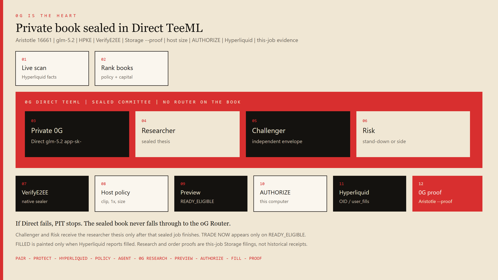
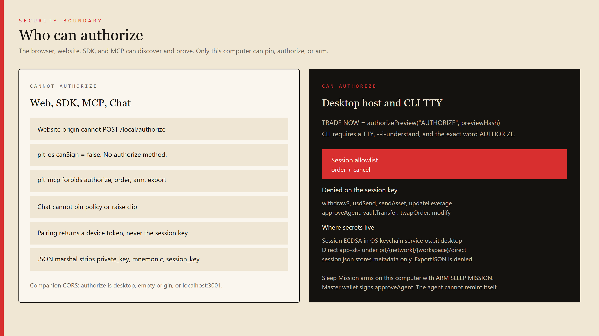
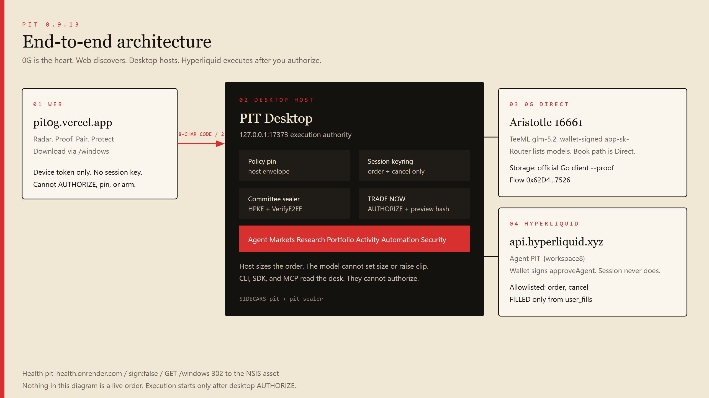
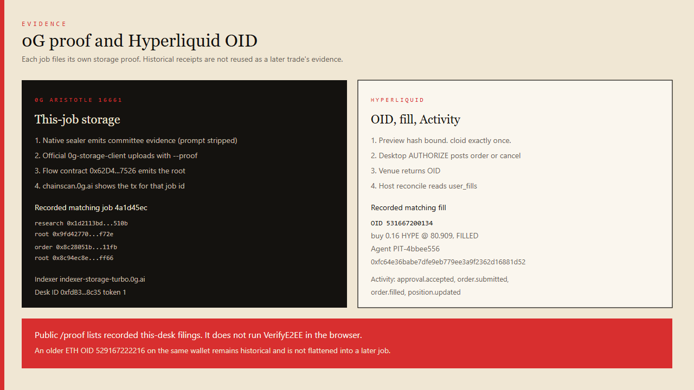

# PIT

PIT is a private trading desk whose **heart is 0G**. The private book never sits on a public chat API. It enters 0G Direct TeeML on Aristotle 16661, is independently challenged inside sealed envelopes, verified on the host, sized by policy, and only then turned into an exact Hyperliquid action you authorize on this computer. The model cannot set size. Sleep Mission is optional bounded host execution and only arms here. The web discovers and proves. The desktop protects and acts.

**Product 0.9.13** · companion `127.0.0.1:17373` · website [pit0g.vercel.app](https://pit0g.vercel.app) · health [pit-health.onrender.com](https://pit-health.onrender.com/health) (`sign: false`, version `0.9.13`) · installer [direct Windows download](https://pit-health.onrender.com/windows)

---

## Watch PIT in action

The launch film is the live desk path, not a storyboard.

**Pair → Protect → Hyperliquid → Policy → Agent → 0G Direct → Researcher → Challenger → Risk → VerifyE2EE → exact preview → AUTHORIZE → fill → proof.**

- Watch: [https://youtu.be/zYgxDTI7jIk](https://youtu.be/zYgxDTI7jIk)
- Local master: `edit/PIT-launch.mp4`

Matching recorded evidence (job `4a1d45ec-8c3f-4883-a162-19739accb9cf`): HYPE OID **531667200134** FILLED, with this-job 0G research and order filings on Aristotle. PIT paints FILLED only when Hyperliquid `user_fills` reports filled.



---

## Why 0G is the heart

A trading book in a public router leaks alpha. A withdraw key empties an account. PIT exists because **private inference, sealed research, TEE verification, provenance, storage proofs, and verifiable order evidence** have to live on 0G — not in the browser, not in MCP, not in a cloud LLM.

| 0G capability | What PIT uses it for |
|---|---|
| Direct TeeML glm-5.2 | Wallet-signed `app-sk-` inference over the private book plus live Hyperliquid facts |
| Native sealer | HPKE seal of the prompt; host `VerifyE2EE` against on-chain `teeSigner` |
| Private committee | Sequential Researcher → Challenger → Risk, each a sealed Direct envelope |
| Storage `--proof` | Official Go client files this-job research and order objects |
| Aristotle 16661 | Production chain for Serving, Ledger, Flow, Desk ID, and explorer proofs |
| Provenance | This-job roots and txs — historical receipts are not used as fallback |

**0G Direct + glm-5.2.** Provider URL comes from on-chain `getService`. The Direct token stays in the OS keychain under `pit/{network}/{workspace}/direct`. The Router may **list** models. It is forbidden as the inference URL for the sealed book. If Direct fails, PIT **stops**.

**Native sealer / HPKE / VerifyE2EE.** `pit-sealer` seals the book into Direct TeeML and verifies the TEE transcript on the host against `teeSigner` `0xA46EA4FC5889AD35A1487e1Ed04dCcfa872146B9`. Provider `0x7DCFe6AEa70350C2090041524c9B4A9262DCe87D`. Serving `0x47340d900bdFec2BD393c626E12ea0656F938d84`. Ledger `0x2dE54c845Cd948B72D2e32e39586fe89607074E3`.

**0G Storage `--proof`.** Object keys are `{network}/ws/{workspaceId}/...`. Flow [`0x62D4144dB0F0a6fBBaeb6296c785C71B3D57C526`](https://chainscan.0g.ai/address/0x62D4144dB0F0a6fBBaeb6296c785C71B3D57C526). Explorer [storagescan.0g.ai](https://storagescan.0g.ai/). Recorded storage proof [submission 211566](https://storagescan.0g.ai/submission/211566). The TypeScript SDK is not used for proofs.

**Aristotle 16661.** Explorer [chainscan.0g.ai](https://chainscan.0g.ai). `PIT_NETWORK` binds 0G chain and Hyperliquid venue together (Aristotle with `api.hyperliquid.xyz`).

The sealed prompt never enters Vercel, the browser bundle, MCP, or `pit-os`. TRADE NOW on desktop calls `authorizePreview("AUTHORIZE", previewHash)`. Chat, the website, MCP, and the JS SDK cannot AUTHORIZE.





---

## The complete user journey

1. Download PIT Desktop. Health `GET /windows` 302s to the GitHub **asset** `PIT_0.9.13_x64-setup.exe`.
2. Launch. The companion listens on `127.0.0.1:17373` only.
3. **Pair** a browser with a one-time 8-character code (two-minute TTL). The browser receives a device token, never the session key.
4. **Protect my strategy.** The wallet signs. The Direct token stays in the OS keychain.
5. **Connect Hyperliquid.** PIT generates `PIT-{workspace8}` locally. Your wallet signs `approveAgent`. PIT verifies `extraAgents` on the **master** wallet.
6. **Pin policy** on Security (clip, assets, 1x, kill). Chat cannot pin. You can edit and re-pin after Ready.
7. Open **Agent**. Ask **Find the best opportunity**, **Find the best long**, **Find the best short**, or **What can I trade now?**
8. Watch live scan and ranking against Hyperliquid marks, oracle, funding, open interest, and venue minimums.
9. The **private book enters 0G Direct TeeML**. Researcher, then Challenger (with the thesis), then Risk — sequential sealed envelopes.
10. Host `VerifyE2EE` via `pit-sealer`. Policy and host sizing clip the order. The model cannot set size.
11. If a side survives, the host builds an exact preview. TRADE NOW appears only on `READY_ELIGIBLE`.
12. You authorize on this computer, or you walk away.
13. Hyperliquid returns an OID. PIT says FILLED only when `user_fills` reports filled.
14. This-job 0G research and order proofs file to Aristotle Storage.
15. **Activity** is the ledger. **Portfolio** is the venue. Encrypted Skillbook / experience stay on this computer. **Sleep Mission** is optional and arms only here.

---

## Pairing

Pairing is step 1. Ready requires it.

- Desktop shows an 8-character code.
- Code TTL is two minutes. Replay is denied.
- `POST /pair` is allowed from `https://pit0g.vercel.app`.
- The pairing response is `{sign:false, canSign:false, device}`.
- Production `/protect` stays locked until this browser is paired.
- `/signin` and `/app/start` redirect to `/pair`.

---

## Protect my strategy

Protect is step 2. It funds sealed inference.

- You connect a wallet (Privy app id `cmtafcijw02av0cl1ay81om7m` is public).
- PIT never asks for a seed phrase.
- The wallet-signed Direct token (`app-sk-`, 24h) is stored in the OS keychain under `pit/{network}/{workspace}/direct`.
- The website does not receive the token.
- Router `sk-` / `mk-` keys are refused on the book path.

---

## Connect Hyperliquid

Connect is step 3.

- PIT creates or reuses the local agent named `PIT-` plus the first eight hex characters of the workspace (under 17 characters).
- Copy the PIT Agent address onto the official Hyperliquid API page. Do not paste an invented API wallet into PIT.
- Your **master** wallet signs `approveAgent`. The session key is forbidden from signing `approveAgent`.
- Ready requires a live `extraAgents` listing for that agent on the master wallet.
- Recorded agent on this desk: `PIT-4bbee556` at [`0xfc64e36babe7dfe9eb779ee3a9f2362d16881d52`](https://app.hyperliquid.xyz). Reused. Not reminted.

---

## Hyperliquid agent authorization and permissions

PIT reads live marks, oracle, funding, open interest, and venue minimums from `https://api.hyperliquid.xyz/info`.

**Allowed session actions:** `order`, `cancel`.

**Denied on the session key (explicit):** `withdraw3`, `usdSend`, `spotSend`, `usdClassTransfer`, `sendAsset`, `updateLeverage`, `updateIsolatedMargin`, `vaultTransfer`, `subAccountTransfer`, `createSubAccount`, `subAccountModify`, `approveAgent`, `approveBuilderFee`, `cDeposit`, `cWithdraw`, `tokenDelegate`, `spotDeploy`, `convertToMultiSigUser`, `userSetAbstraction`, `userDexAbstraction`, `twapOrder`, `twapCancel`, `batchModify`, `modify`, `scheduleCancel`, `setReferrer`, `reserveRequestWeight`, `noop`.

Minimum notional follows the book. Tick rounding uses 5 significant figures. Host size is clipped by pinned policy. PIT does not invent perp margin from spot USDC unless Hyperliquid reports unified account mode.

---

## Policy / host envelope

Policy is host-authoritative: clip, daily loss, leverage, allowlist, venue, calibration floor, cooldown, uncertainty, slippage, liquidity, kill.

You edit and pin on Security (`POST /local/policy`, desktop origin). After Ready, the editor stays on that page so you can change values and re-pin. Chat cannot pin. The model cannot raise `maxClip`.

Pin writes `{UserConfigDir}/pit/{workspaceId}.policy` and a hash. Preview hash binding: any mutation of the card invalidates AUTHORIZE. Exactly-once `cloid`. Restart keeps a previewed action. A second click is `duplicate_click`. Kill switch and daily loss halt stop new orders.

---

## Agent cockpit

Desktop rail: **Desk, Agent, Markets, Research, Portfolio, Activity, Automation, Health, Security**.

Agent phrases that start a hunt:

- Find the best opportunity
- Find the best long
- Find the best short
- What can I trade now?

Hunt phrases win over a TRADE NOW substring, so “What can I trade now?” starts research instead of authorizing.

---

## Live market discovery

The host scans currently executable books against live Hyperliquid data and pinned policy/capital. Public website Watch has no buying power, so it will not mark a coin executable for your account. Desktop Markets shows the six-book universe used by this desk (ETH, BTC, SOL, HYPE, DOGE, AVAX under the recorded policy).

---

## Ranking and executable-book logic

Remaining books are ranked. Chat hunts skip only this-hunt `hunt-skip.json`. Automation keeps its own 4h skips. The hunt continues after a genuine NO TRADE and does not restart already-tested books. It stops when a side survives or the executable universe is exhausted. Universe exhausted with no `READY_ELIGIBLE` is a real stand-down: TRADE NOW is not shown.

---

## Private 0G Direct research

0G is required because the private book must not sit on a public router.

| Piece | Role |
|---|---|
| Direct TeeML | Provider URL from on-chain `getService`. Wallet-signed `app-sk-`. HPKE + `VerifyE2EE` + on-chain `teeSigner`. |
| Router | Allowed only to **list** models. Forbidden as the inference URL for the sealed book. |
| Storage | Official Go client with `--proof`. Object keys are `{network}/ws/{workspaceId}/...`. |
| Aristotle `16661` | Production chain. Explorer [chainscan.0g.ai](https://chainscan.0g.ai). |

Mainnet glm-5.2 Direct path (Seal + VerifyE2EE in the native sealer):

- Provider `0x7DCFe6AEa70350C2090041524c9B4A9262DCe87D`
- teeSigner `0xA46EA4FC5889AD35A1487e1Ed04dCcfa872146B9`
- Serving `0x47340d900bdFec2BD393c626E12ea0656F938d84`
- Ledger `0x2dE54c845Cd948B72D2e32e39586fe89607074E3`

If Direct fails, PIT **stops**. It does not fall back to the Router. Researcher, Challenger, and Risk run as sequential sealed roles with independent envelopes on Direct TeeML.

---

## Researcher / Challenger / Risk / TEE / Policy pipeline

1. **Scanning** live Hyperliquid facts.
2. **Ranking** remaining executable books.
3. **Private 0G** job for this book (Direct TeeML glm-5.2).
4. **Researcher** proposes a side from live facts (does not echo `hypothesis: none`).
5. **Challenger** receives `researcher_thesis` after the researcher job.
6. **Risk** sees the same sequential envelope.
7. **TEE** — host `VerifyE2EE` via `pit-sealer`.
8. **Policy** — host clip, 1x, allowlist, kill. Host sizes. The model cannot set size.
9. **Decision** — READY preview or named NO TRADE with this-job 0G.
10. **AUTHORIZE** on this computer → Hyperliquid OID → this-job Storage `--proof`.

Forecasts are labeled as committee output. Live market facts come from the venue.

---

## Exact preview

TRADE NOW appears only on `READY_ELIGIBLE` with an exact preview: coin, side, host size, mark, notional, clip, policy version, preview hash.

Recorded matching preview (HYPE job `4a1d45ec`):

- Hash `0xb273d0052fe389b5e5ad3aad4b176e1cc993b8d8e605716bab78c70f3814e401`
- Host sized buy 0.16 HYPE at 80.909, notional $12.95, clip $13, 1x
- Path `authorize`

After a fill, TRADE NOW on that preview is disabled.

---

## Human authorization boundary

TRADE NOW is not a second signer. It injects the exact token `AUTHORIZE` into the existing host path with the bound preview hash.

| Surface | Authorize |
|---|---|
| Desktop | `POST /local/authorize` from Tauri / `localhost:3001` |
| CLI | TTY + `--i-understand` + exact `AUTHORIZE` + live session |
| Web, MCP, pit-os, chat | No authorize method. Companion `/authorize` is denied. |

Piped `yes` is rejected on the CLI.

---

## Real Hyperliquid execution

After AUTHORIZE the host posts `order` or `cancel` through the session. Limit TIF is `Gtc`. The model cannot set size. Withdraw and transfer remain forbidden.

---

## OID / fill / close lifecycle

1. Venue returns OID.
2. Host reconcile queries `user_fills`.
3. Agent card STATUS is **FILLED** only on a fill-ish venue status. RESTING stays RESTING.
4. Activity records `approval.accepted`, `order.submitted`, `order.filled`, `position.updated`.
5. Duplicate TRADE NOW is not offered for that preview’s OID.

Recorded matching fill: OID **531667200134**, buy 0.16 HYPE @ 80.909, FILLED. The OID proves the fill event. It does not mean the position is still open.

An older Hyperliquid fill on the same account, OID `529167222216` (ETH), is historical and was not flattened.

---

## 0G storage / chain proof



Research proof and order proof are filed to 0G Storage for **that** job via the official Go client with `--proof`. `last-research.json` is not a 0G fallback. Public `/proof` lists recorded this-desk filings. It does not run VerifyE2EE in the browser.

---

## Activity / evidence trail

Desktop **Activity** is the ledger of this workspace: approvals, orders, fills, cancels, named no-trades. It does not invent a public live stream.

**Portfolio** is Hyperliquid positions and buying power for the bound wallet.

**Health** (Strategy Health) shows calibration. Brier / ECE stays **NOT ENOUGH DATA** until the sample is large enough. Skills are listed only from resolved observations.

The public website does not show your book.

---

## Memory / Skillbook

PIT preserves workspace knowledge on this computer. It does not claim the model learned to trade.

- **Skillbook** (`skillbook.enc`) is AES-sealed on disk. Entries are typed memory rows (observation, forecast, execution, outcome, and related kinds). `PublicSkillbook` returns **NOT ENOUGH DATA** until `experience.MinSamples` (5) verified memory rows. Skills never carry `sign`, `trade`, or `authorize`.
- **Experience** (`experience.enc`) is a workspace-local journal of verified cases: coin, decision, preview hash, OID, and a why line. Research, fills, and resting OIDs append here. Chat “why this setup” reads `experience.why`. It cannot AUTHORIZE.
- **Strategy Health** UI copy is “Resolved observations only.” A skill with no resolved outcomes stays NOT ENOUGH DATA. Calibration (Brier / ECE) stays unpublished until the sample floor.
- **Forget** is desktop Security: `POST /local/memory/forget`. Two wallets never share a workspace, session, policy, or memory key.
- **MCP / pit-os** experience surfaces are read-only. They print NOT ENOUGH DATA rather than invent skill performance.
- `PIT_PRODUCT_MODE` refuses a global `PIT_MEMORY_KEY`. Future agent behavior on this desk can retrieve those sealed rows; PIT will not invent that the desk already learned.

---

## Sleep Missions / bounded automation

A Sleep Mission is optional bounded host execution while this computer stays awake. The bound runs on the same host that holds the session, the policy pin, and `pit-sealer`. The website cannot keep a mission alive.

- Desktop Automation posts `ARM SLEEP MISSION` (or `ENABLE GUARDED AUTONOMY`) to `/local/mission` (desktop origin, pin required).
- CLI `pit mission arm` requires a TTY.
- Chat, the website, MCP, the JS SDK, and the model cannot arm it.
- If the machine sleeps, the mission stops. That gap is not backfilled.

---

## Web architecture

Vite + Privy. No Hyperliquid session. Production: [https://pit0g.vercel.app](https://pit0g.vercel.app).

Public routes: `/`, `/radar`, `/capital`, `/autonomy`, `/missions`, `/proof`, `/agent`, `/how-it-works`, `/download`, `/pair`, `/protect`. Redirects: `/watch` → `/radar`, `/signin` → `/pair`, `/verify` → `/proof`, `/app/start` → `/pair`.

`vercel.json` sends `/windows` and `/checksums` to health, which 302s to the GitHub **asset** (empty HTML body).

Playwright asserts public routes render without an Authorize button.

---

## Desktop architecture

Tauri identifier `os.pit.desktop`. Sidecars: `binaries/pit`, `binaries/pit-sealer`. Companion origin `http://127.0.0.1:17373`.

Loopback routes include `/health`, `/pair`, `/status`, `/local/*` (status, code, session, policy, authorize, cancel, research, mission, kill). Explicit denials: `/authorize`, `/export`, `/session`.

---

## CLI

```powershell
cd pit
go run ./cmd/pit version
go run ./cmd/pit doctor
go run ./cmd/pit status
go run ./cmd/pit opportunities
```

`pit version` prints `PIT 0.9.13`.

Also: `init`, `login`, `wallet`, `pair`, `network`, `logout`, `revoke`, `policy`, `kill`, `session`, `companion`, `approve`, `hyperliquid`/`agent`, `compute`, `watch`, `scan`, `mission`, `chat`, `positions`, `health`, `activity`, `receipt`, `direct`, `ask`, `research`, `forecast`, `calibration`, `memory`, `preview`, `authorize`, `execute`, `orders`, `cancel`, `status`, `resolve`, `card`, `verify`, `proof`, `doctor`, `mcp`, `update`.

`pit companion` listens on `127.0.0.1:17373` only.

---

## SDK

```powershell
npm install pit-os
```

Published **pit-os 0.9.11**. Read-only helpers: public health, public watch, loopback companion status. `canSign` is always `false`. There is no authorize method.

```ts
import { canSign, publicHealth, publicWatch, refuseAuthorize } from "pit-os";

canSign; // false
await publicHealth();
await publicWatch("mainnet");
```

The Go package `pit/sdk` is the same capability-denial surface for Go apps (`CanHoldSession`, `CanAuthorizePreview`, `CanExecute` all false). It does not call companion HTTP.

---

## MCP

Cursor-compatible stdio MCP, published **pit-mcp 0.9.12**:

```json
{
  "mcpServers": {
    "pit": {
      "command": "npx",
      "args": ["-y", "pit-mcp"]
    }
  }
}
```

Tools: `pit_health`, `pit_watch`, `pit_release`, `pit_companion_health`, `pit_status`, `pit_activity`, `pit_positions`, `pit_research_status`, `pit_proofs`, `pit_security`.

Not tools: authorize, order, cancel, export_session, arm.

The Go binary `go run ./cmd/mcp` is a custom NDJSON loop. It is still read-only. Use `pit-mcp` for Cursor.

---

## Contracts and on-chain components

Foundry 0.8.24 in `contracts/`:

| Contract | What is shipped |
|---|---|
| `PitDeskID` | Production Aristotle address. Mint, authorizeUsage, revoke. ERC-721 `transferFrom` disabled. |
| `PitPolicy` | Pin, hash, owner isolation (Foundry). Host pin in product is the local policy file. |
| `PitReceipts` | Receipt filing, no double-file (Foundry). |
| `PitForecasts` | Forecast records (Foundry). |
| `PitMemory` | Workspace-scoped memory (Foundry). |

Live proof used on this desk is **0G Storage with `--proof`**, not a receipts-contract address.

Serving `0x47340d900bdFec2BD393c626E12ea0656F938d84`, ledger `0x2dE54c845Cd948B72D2e32e39586fe89607074E3`, storage flow `0x62D4144dB0F0a6fBBaeb6296c785C71B3D57C526`.

`PIT_NETWORK` selects 0G chain and Hyperliquid venue together. Aristotle `16661` with `api.hyperliquid.xyz`. Galileo `16602` with Hyperliquid testnet. Do not mix them. Mainnet sealed committee is glm-5.2 Direct.

---

## ERC-8004 / identity

Official 0G registries (not PIT-authored):

- Identity [`0x8004A169FB4a3325136EB29fA0ceB6D2e539a432`](https://chainscan.0g.ai/address/0x8004A169FB4a3325136EB29fA0ceB6D2e539a432)
- Reputation [`0x8004BAa17C55a88189AE136b182e5fdA19dE9b63`](https://chainscan.0g.ai/address/0x8004BAa17C55a88189AE136b182e5fdA19dE9b63)

Recorded agentId **3489333**. Register tx [`0xa2f67529745a662163b84fe10f855a3aa25596f9bc4d4c604d2abefbc3f3ff7d`](https://chainscan.0g.ai/tx/0xa2f67529745a662163b84fe10f855a3aa25596f9bc4d4c604d2abefbc3f3ff7d). Host checks: reporter must differ from owner; owner self-feedback is refused; IDs are not portable across networks. Public `/agent` reads `ownerOf` as a chain fact, not a ranking.

---

## ERC-7857 / Desk ID

Production Desk ID (Aristotle): [`0xfdB3a8D39F1E2b77a8261b359eABaaa2F08f8c35`](https://chainscan.0g.ai/address/0xfdB3a8D39F1E2b77a8261b359eABaaa2F08f8c35)

- Deploy [`0x2d5b688bf09bb72cb44b092da0c27cbe87a623141872e62b84cb95ecf7e90c24`](https://chainscan.0g.ai/tx/0x2d5b688bf09bb72cb44b092da0c27cbe87a623141872e62b84cb95ecf7e90c24)
- Mint tokenId 1 [`0x9494e3faec6d950942d1bfec53c4a13e6f28378da8e01ecd24b3e3de62e5c7d0`](https://chainscan.0g.ai/tx/0x9494e3faec6d950942d1bfec53c4a13e6f28378da8e01ecd24b3e3de62e5c7d0) owner `0xbdfcee82bd42fefa58ee850b3709636a8b6b0034`

Interface IDs: `0x2afbede9` (IERC7857) / `0xdf597d99` (Authorize) / `0x74f8628b` (Cloneable) / `0x80ac58cd` (ERC-721). `transferFrom` is disabled (`ERC7857UseITransferFrom`). `iTransferFrom` / `iCloneFrom` revert `AttestorNotOnAristotle` — the Foundation TEE attestor used for those calls is not the Aristotle product path.

---

## Security model

- The model cannot AUTHORIZE.
- The browser cannot access the session key.
- The website origin cannot `POST /local/authorize`.
- `pit-os` and `pit-mcp` have no authorize / order / export / arm methods.
- Session cannot withdraw, transfer, raise leverage, or `approveAgent`.
- Preview hash binding. Exactly-once `cloid`.
- FILLED is only painted when Hyperliquid reports a fill-ish status.
- 0G receipts are this-job.
- Policy hash is pinned. The model cannot raise clip.
- Private book has no Router fallback.
- Sealer VerifyE2EE runs on the host.
- No global memory key in `PIT_PRODUCT_MODE`. Doctor fails if `PIT_MEMORY_KEY` is set.
- Secrets stay out of the web bundle and npm tarball.

---

## Secrets / session-key handling

| Kind | Rule |
|---|---|
| Public infra | RPCs, contract addresses, Privy **app id** — in `.env.example` |
| User secrets | Session key, memory key, Direct token — OS keychain only |
| Forbidden | Router `sk-` / `mk-` for the private book |
| Kill | `PIT_ALLOW_FALLBACKS` if set must be `false`; any other value exits |

`session.json` stores id, agent address, workspace, network, policy version, expiry — not the secret. The ECDSA lives in Windows Credential Manager / macOS Keychain / libsecret, service `os.pit.desktop`, item `{workspaceID}/session/{sessionID}`. `PIT_KEYRING=file` (CI) uses mode 0600 files. `AgentKey.ExportJSON()` is `session_export_denied`.

Copy `.env.example` to `.env`. **Do not commit `.env`.**

---

## Authority boundaries

| Surface | Can do | Cannot do |
|---|---|---|
| [pit0g.vercel.app](https://pit0g.vercel.app) | Radar, proof, pair, Protect, download | Hold a session key, AUTHORIZE, pin, arm |
| PIT Desktop | Policy, session, research, TRADE NOW, Activity, Portfolio, Sleep Mission | Withdraw or transfer |
| Health | Public `/health`, `/watch`, `/release`, `/windows` | Sign or trade (`sign: false`) |
| pit-os / pit-mcp | Read health, watch, loopback status | Sign, order, arm, export |

---

## CI/CD

Workflows: `.github/workflows/ci.yml`, `.github/workflows/release.yml`.

CI jobs on every push/PR: `go` (`cd pit && go test ./...`), `sealer` (`go test ./...` + `go build`), `contracts` (`forge test -vvv`), `web` (`npm run build` + `npx playwright test`), `desktop` (`npm run build`), `sdk` (`npm test` in `sdk/js`), `mcp` (`npm test` in `sdk/mcp`).

Release workflow: Windows NSIS, builds `pit` + `pit-sealer` sidecars, uploads `SHA256SUMS.txt`.

HEAD `e431e3bd30f76a7506b6ae5cf140fc4f4a8a3f36` tagged `v0.9.13`. CI run [33413773180](https://github.com/mohamedwael201193/pit/actions/runs/33413773180) on that commit: **success**.

---

## Test strategy

| Suite | Command | Result |
|---|---|---|
| Go `pit` | `go test ./... -count=1` (`PIT_ALLOW_FALLBACKS=false` `PIT_KEYRING=file`) | **654 PASS / 0 FAIL** |
| Sealer | `go test ./...` | **6 PASS** |
| Foundry | `forge test -vvv` | **26 PASS / 0 FAIL** (21 unit + 4 fuzz × 256 runs + Desk ID interface IDs) |
| `pit-os` | `npm test` | **2 PASS** |
| `pit-mcp` | `npm test` | **3 PASS** |
| Web Playwright | `npx playwright test` | **30 PASS** |
| Desktop e2e | `npx tsx e2e/run.ts` | **PASS** |

CI on `e431e3b` ([run 33413773180](https://github.com/mohamedwael201193/pit/actions/runs/33413773180)): **success**.

```powershell
cd pit
go test ./...

cd ..\sealer
go test ./...

cd ..\contracts
forge test -vvv

cd ..\sdk\js
npm test

cd ..\sdk\mcp
npm test

cd ..\apps\web
npm run build
npx playwright test

cd ..\apps\desktop
npm run build
npx tsx e2e/run.ts
```

---

## Production deployment

| Surface | URL / value |
|---|---|
| Website | https://pit0g.vercel.app |
| Health | https://pit-health.onrender.com/health — `{"ok":true,"sign":false,"version":"0.9.13"}` |
| Direct installer | https://pit-health.onrender.com/windows — HTTP 302 to the GitHub asset |
| Vercel `/windows` | 307 → health `/windows` |
| GitHub | [v0.9.13](https://github.com/mohamedwael201193/pit/releases/tag/v0.9.13) |
| npm | `pit-os@0.9.11`, `pit-mcp@0.9.12` |

---

## Release / install / direct Windows installer

Use the **file** endpoint, not the GitHub Releases HTML page.

1. Open [pit0g.vercel.app](https://pit0g.vercel.app)
2. Click **Download PIT Desktop** — files `PIT_0.9.13_x64-setup.exe`
3. Or open [https://pit-health.onrender.com/windows](https://pit-health.onrender.com/windows)
4. Verify SHA256 `B905B9ED167513757D4947BDE61103EB10ECD4A5F76554FE369F205DF3850B1E` (also in health `/release` and GitHub asset digest)
5. Install and launch PIT
6. Pair at [/pair](https://pit0g.vercel.app/pair)
7. Sign **Protect my strategy**
8. Stay on MAINNET. Connect Hyperliquid. Pin policy. Approve the printed PIT Agent (order and cancel only).

```powershell
Get-FileHash .\PIT_0.9.13_x64-setup.exe -Algorithm SHA256
```

Checksums: [https://pit-health.onrender.com/checksums](https://pit-health.onrender.com/checksums)

---

## Proof links

These are the latest matching research → preview → AUTHORIZE → Hyperliquid fill on this desk (2026-08-31). They belong to job `4a1d45ec-8c3f-4883-a162-19739accb9cf`. They are not a historical fallback. Aristotle RPC `eth_getTransactionByHash` returns these txs (research `to` = storage Flow `0x62D4144dB0F0a6fBBaeb6296c785C71B3D57C526`).

| What | Evidence |
|---|---|
| Research (HYPE, Direct committee) | [0x1d2113bd683b3ef8be5d74d603018c4bacdd49531bdf201abbc7dea4bb16510b](https://chainscan.0g.ai/tx/0x1d2113bd683b3ef8be5d74d603018c4bacdd49531bdf201abbc7dea4bb16510b) |
| Research storage root | `0x9fd42770545ecaacbfff12e3ef7a537b564e31c9ef5515b3a820fd276c22f72e` |
| Order / evidence filing | [0x8c28051bec7bebd7af3b6cc75f7aa034d67f9809f9c30eef9a6c9f84ed6c11fb](https://chainscan.0g.ai/tx/0x8c28051bec7bebd7af3b6cc75f7aa034d67f9809f9c30eef9a6c9f84ed6c11fb) |
| Order storage root | `0x8c94ec8e643c90fe69276ff20f50a0bc3121f007d611e10e6ab9f24d26f2ff66` |
| Hyperliquid OID | `531667200134` buy 0.16 HYPE @ 80.909, host reconcile `user_fills` **FILLED** |
| 0G StorageScan | [storagescan.0g.ai](https://storagescan.0g.ai/) · proof [submission 211566](https://storagescan.0g.ai/submission/211566) |
| Preview hash | `0xb273d0052fe389b5e5ad3aad4b176e1cc993b8d8e605716bab78c70f3814e401` |
| Agent | `PIT-4bbee556` `0xfc64e36babe7dfe9eb779ee3a9f2362d16881d52` |
| Wallet | `0xbdfcee82bd42fefa58ee850b3709636a8b6b0034` |

Recorded 0G research and storage on this desk. Each job has its own filing.

| What | Transaction | Storage root |
|---|---|---|
| HYPE research · job `4a1d45ec` | [0x1d2113bd…](https://chainscan.0g.ai/tx/0x1d2113bd683b3ef8be5d74d603018c4bacdd49531bdf201abbc7dea4bb16510b) | `0x9fd42770545ecaacbfff12e3ef7a537b564e31c9ef5515b3a820fd276c22f72e` |
| HYPE order evidence | [0x8c28051b…](https://chainscan.0g.ai/tx/0x8c28051bec7bebd7af3b6cc75f7aa034d67f9809f9c30eef9a6c9f84ed6c11fb) | `0x8c94ec8e643c90fe69276ff20f50a0bc3121f007d611e10e6ab9f24d26f2ff66` |
| ETH research receipt | [0x3f90c548…](https://chainscan.0g.ai/tx/0x3f90c548a8f9bc04638f459cc9daba37423f04801568457191f2e04fb4090b80) | `0x07238aa66936340f7ea9fa59f279a8e2313b0bb839699c805b91cb30ccb7741d` |
| BTC research receipt | [0xf3d7bc82…](https://chainscan.0g.ai/tx/0xf3d7bc820154ab18198c2b26ce4f3df6748aa65f3b8b07a7336de4a1c202d65a) | `0x9c65f36076cf2ee32c7e9a02354d1aef9ccf5f6c83289dba160b8c08710424d2` |
| S6 encrypted roundtrip | — | `0x3b4b3b772aae7195109ded219ca861da7eb3ca51776538e3486f7084b4ef193a` |
| HYPE hunt `9761cbd5` | [0x266c45cb…](https://chainscan.0g.ai/tx/0x266c45cbd35cb8b9e856d7f3c850e5ce72d34fb33251bba616345e34cd04cb78) | — |
| Long hunt HYPE `7d28f3e3` | [0x6009ede3…](https://chainscan.0g.ai/tx/0x6009ede35278fc6157507792388b87e2f0c7173494a32095fb0692bc65c77ff4) | — |
| HYPE none-hypothesis | [0x30df71b9…](https://chainscan.0g.ai/tx/0x30df71b929e05a4feca6d4683bbe86af97750b70807a28957bcc54e2d99aa4ed) | — |
| DOGE job `b4ed73ce` | [0x28f0f747…](https://chainscan.0g.ai/tx/0x28f0f7474760ec88c8c2a76f9959e136756eb5dd8ccfd530eb43d38c10f7277c) | — |
| HYPE storage | [0x8c8b78e8…](https://chainscan.0g.ai/tx/0x8c8b78e8add46c79983d344ac571bcb8e6fd1d6c2ae072add00147f2ede1151d) | — |
| Research | [0xcc02a780…](https://chainscan.0g.ai/tx/0xcc02a780b12ed2a884d3aa845f486acb89c60f1e8c306f0773e147f5311b4438) | — |
| Research | [0xd682aa45…](https://chainscan.0g.ai/tx/0xd682aa45aea64a26d1ab7a18d9867260a38502b086b9730010a394011ef6114c) | — |
| Research | [0x2a7a5838…](https://chainscan.0g.ai/tx/0x2a7a58381ef4507174a777fb2f9a65d826d9988ce22610fc16b4d9e1fcd54b9d) | — |
| Research | [0x2045c98a…](https://chainscan.0g.ai/tx/0x2045c98a69aae505ee5be36eaa1cf05c5d93c2662d90b5d7b07dc8452d537711) | — |
| BTC challenger_killed | [0x6abe4377…](https://chainscan.0g.ai/tx/0x6abe43772f1b953e2c6debec31dba1d64b77a7f8c3b6f83cf950f18f11e263e4) | — |
| SOL no_side | [0x7e7f85aa…](https://chainscan.0g.ai/tx/0x7e7f85aaf4aacd29129b8697cbc5de7e8f6d56745754897807a262e2d31b21ef) | — |
| ETH job `78617f6c` | [0xdf4f8f95…](https://chainscan.0g.ai/tx/0xdf4f8f95cbee81f99402754455915635bbc3f4623861318f5fc171da631f8ae0) | — |

Storage: [storagescan.0g.ai](https://storagescan.0g.ai/). Proof: [submission 211566](https://storagescan.0g.ai/submission/211566).

---

## Verification instructions

1. Health JSON `version` is `0.9.13` and `sign` is `false`.
2. `GET /windows` is 302 with `content-disposition: attachment; filename="PIT_0.9.13_x64-setup.exe"` and Location the GitHub **asset** URL.
3. SHA256 of the installer matches `B905B9ED167513757D4947BDE61103EB10ECD4A5F76554FE369F205DF3850B1E`.
4. `pit version` prints `PIT 0.9.13`.
5. Pairing page never asks for a seed. Protect stays locked until paired.
6. extraAgents on the master wallet lists `PIT-4bbee556`.
7. TRADE NOW is absent unless a `READY_ELIGIBLE` preview exists.
8. Aristotle explorer shows the research and order txs above.
9. Hyperliquid OID `531667200134` is the recorded FILLED matching that job.
10. `npm test` in `sdk/js` and `sdk/mcp` refuses authorize.

---

## Developer setup

```powershell
copy .env.example .env
cd pit
go test ./...
go run ./cmd/pit companion
```

Desktop: `apps/desktop` — `npm install`, `npm run sidecar`, `npm run tauri`. Web: `apps/web` — `npm install`, `npm run dev` with `VITE_PRIVY_APP_ID` and `VITE_HEALTH_URL`. Sealer: Go 1.24, `go build -o pit-sealer .` in `sealer/`.

---

## Repository layout

```
pit/                 Go module — CLI, companion, engine, MCP NDJSON
  cmd/pit            CLI
  cmd/mcp            Read-only NDJSON MCP
  cmd/health         Public Watch + installer redirect
  sdk/               Go capability-denial client (CanSign false)
sdk/js               npm pit-os
sdk/mcp              npm pit-mcp (Cursor MCP protocol)
contracts/           Foundry
sealer/              Native Direct TeeML (HPKE + VerifyE2EE)
apps/web             Vite + Privy (no HL session)
apps/desktop         Local authorize surface
docs/diagrams        Architecture, authority, pipeline, proof
```

---

## Latest release

- Product **0.9.13** · commit `e431e3bd30f76a7506b6ae5cf140fc4f4a8a3f36` · tag `v0.9.13`
- Installer `PIT_0.9.13_x64-setup.exe`
- SHA256 `B905B9ED167513757D4947BDE61103EB10ECD4A5F76554FE369F205DF3850B1E`
- Direct file: [https://pit-health.onrender.com/windows](https://pit-health.onrender.com/windows)
- npm `pit-os` **0.9.11** and `pit-mcp` **0.9.12**
- Demo: [https://youtu.be/zYgxDTI7jIk](https://youtu.be/zYgxDTI7jIk)

---

## License

MIT (`LICENSE`).
