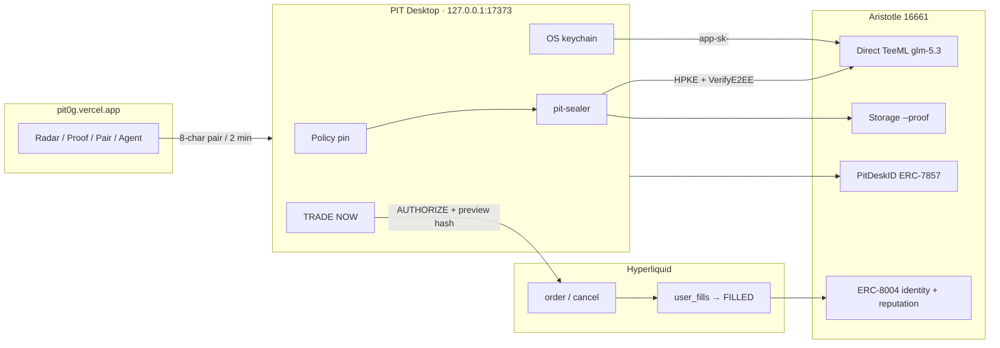
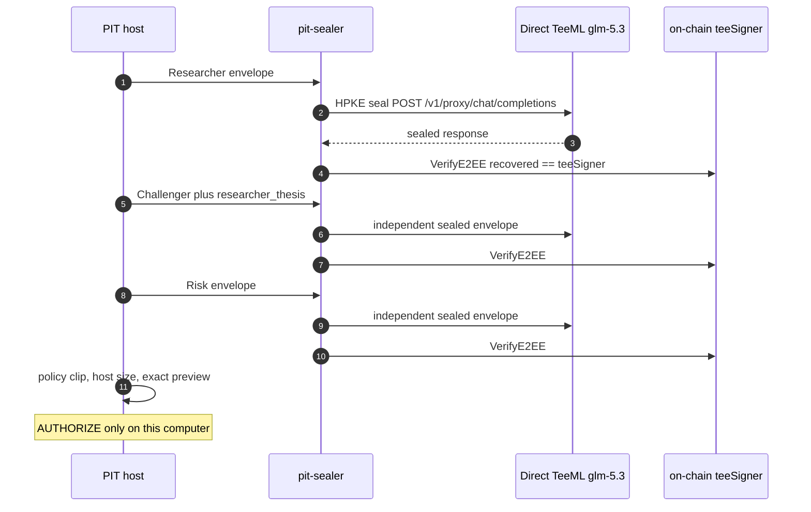

<div align="center">

# PIT

**Private intelligence on 0G. A real Hyperliquid order on this computer.**

Product **0.9.13** · companion `127.0.0.1:17373`

[Website](https://pit0g.vercel.app) · [Health](https://pit-health.onrender.com/health) (`sign: false`) · [Windows installer](https://pit-health.onrender.com/windows) · [Agent card](https://pit0g.vercel.app/.well-known/agent-card.json) · [Launch film](https://youtu.be/zYgxDTI7jIk)

</div>

<p align="center">
  
</p>

```
private book
    → 0G Direct TeeML glm-5.3
    → Researcher / Challenger / Risk
    → host VerifyE2EE
    → policy size
    → AUTHORIZE on this computer
    → Hyperliquid OID / fill
    → 0G Storage --proof
    → ERC-7857 usage + ERC-8004 reputation
```

The website discovers and proves. The desktop protects and acts. The model cannot set size, pin policy, or AUTHORIZE. If Direct TeeML is gone, PIT **stops**. It does not fall back to Router inference.

---

## Recorded Mainnet fill

Job `4a1d45ec-8c3f-4883-a162-19739accb9cf` · agent `PIT-4bbee556` · FILLED only from Hyperliquid `user_fills`.

| | |
|---|---|
| OID | **531667200134** buy 0.16 HYPE (docs @ 80.909 · live `px` 80.826) |
| Research | [`0x1d2113bd…510b`](https://chainscan.0g.ai/tx/0x1d2113bd683b3ef8be5d74d603018c4bacdd49531bdf201abbc7dea4bb16510b) → Flow `0x62D4…7526` |
| Order evidence | [`0x8c28051b…11fb`](https://chainscan.0g.ai/tx/0x8c28051bec7bebd7af3b6cc75f7aa034d67f9809f9c30eef9a6c9f84ed6c11fb) |
| Storage | [submission 211566](https://storagescan.0g.ai/submission/211566) |
| Wallet | `0xbdfcee82bd42fefa58ee850b3709636a8b6b0034` |
| Agent | `0xfc64e36babe7dfe9eb779ee3a9f2362d16881d52` |

Historical ETH OID `529167222216` is an older fill on the same account. Not flattened. Not reminted.

---

## Architecture

<p align="center">
  
</p>



---

## 0G Direct TeeML

Live `getService` on Aristotle. Identity of the SKU is provider + URL + TeeML + teeAck. `teeSigner` is copied from `getService` because TEE keys rotate.

```
provider      0x7DCFe6AEa70350C2090041524c9B4A9262DCe87D
url           https://compute-network-19.integratenetwork.work
model         glm-5.3
verifiability TeeML
teeAck        true
teeSigner     0x041a09E5bEF30fd776D66Bb892d18B97637C7C7c
Serving       0x47340d900bdFec2BD393c626E12ea0656F938d84
Ledger        0x2dE54c845Cd948B72D2e32e39586fe89607074E3
RPC           https://evmrpc.0g.ai  chain 16661
```

`/v1/models` on the pinned provider lists only glm-5.3 TeeML. `/v1/e2ee/pubkey` signer equals on-chain `teeSigner`. Router catalog listings are refused as inference. Locked Direct credit is `getAccount.balance − pendingRefund`. Reclaiming funds are not spendable.

Native `pit-sealer` HPKE-seals the private book. Scheme `zg-sig-v1/e2ee-ct`. Host **VerifyE2EE** recovers the TEE signer and compares it to `getService`. A 200 is not success.

Recorded glm-5.3 committee (independent envelopes, same provider):

| Role | `ZG-Res-Key` |
|---|---|
| Researcher | `a797da3f-bcd3-4a3f-ba4d-ada54e6952c0` |
| Challenger | `b86930b3-5a56-4537-9b80-1a34e20c6f77` |
| Risk | `ea506ef1-fbfa-4dce-af5e-4585489aec61` |

`PIT_NETWORK` binds 0G and Hyperliquid together. Mixed RPC is refused.

---

## Sealed committee

<p align="center">
  
</p>



---

## Authority

Session allowlist: `order`, `cancel`.

Denied on the session key: `withdraw3`, `usdSend`, `spotSend`, `usdClassTransfer`, `sendAsset`, `updateLeverage`, `approveAgent`, and the rest of the withdraw / transfer / leverage / TWAP surface.

Pairing: 8-character code, two-minute TTL. `POST /pair` from `https://pit0g.vercel.app`. Response `{sign:false, canSign:false, device}`. Protect stays locked until paired.

TRADE NOW is desktop App or CLI TTY (`AUTHORIZE` + `--i-understand`). Website, chat, MCP, SDK, health, and the model cannot AUTHORIZE, pin policy, or arm a Sleep Mission.

---

## ERC-7857 Desk ID

PitDeskID [`0xfdB3a8D39F1E2b77a8261b359eABaaa2F08f8c35`](https://chainscan.0g.ai/address/0xfdB3a8D39F1E2b77a8261b359eABaaa2F08f8c35) · token **1** · owner `0xBDfCeE82Bd42FEfA58ee850B3709636a8B6b0034`.

Canonical interface IDs: `0x2afbede9` / `0xdf597d99` / `0x74f8628b` / `0x80ac58cd`. Live `supportsInterface` returns true for all four.

| Call | Proof |
|---|---|
| Deploy | [`0x2d5b688b…`](https://chainscan.0g.ai/tx/0x2d5b688bf09bb72cb44b092da0c27cbe87a623141872e62b84cb95ecf7e90c24) |
| Mint token 1 | [`0x9494e3fa…`](https://chainscan.0g.ai/tx/0x9494e3faec6d950942d1bfec53c4a13e6f28378da8e01ecd24b3e3de62e5c7d0) |
| `authorizeUsage(1, PIT-4bbee556)` | [`0x04498724…`](https://chainscan.0g.ai/tx/0x044987247473fbf15ceec909b439b73029c264ea8a387b7f1b26483e8074fa61) block **43385835** |

`ownerOf` and `isAuthorized` are read from Aristotle. Mint / authorizeUsage / revoke are owner-wallet transactions (EIP-1193 on `/agent`, or `pit identity apply`). The Hyperliquid session key cannot sign them. Sealed research does not wait on the NFT.

```powershell
go run ./cmd/pit identity verify --json
go run ./cmd/pit identity calldata authorize 0xfc64e36babe7dfe9eb779ee3a9f2362d16881d52
```

---

## ERC-8004 identity and reputation

Identity [`0x8004A169FB4a3325136EB29fA0ceB6D2e539a432`](https://chainscan.0g.ai/address/0x8004A169FB4a3325136EB29fA0ceB6D2e539a432) · agent **3489333** · owner the bound wallet.

Reputation [`0x8004BAa17C55a88189AE136b182e5fdA19dE9b63`](https://chainscan.0g.ai/address/0x8004BAa17C55a88189AE136b182e5fdA19dE9b63) · EIP-1967 implementation `0x16e0FA7f7C56B9a767E34B192B51f921BE31dA34`. `getIdentityRegistry` returns the identity proxy.

Registration file: [agent-card.json](https://pit0g.vercel.app/.well-known/agent-card.json) (`eip-8004#registration-v1`).

| Call | Proof |
|---|---|
| `register` agent 3489333 | [`0xa2f67529…`](https://chainscan.0g.ai/tx/0xa2f67529745a662163b84fe10f855a3aa25596f9bc4d4c604d2abefbc3f3ff7d) |
| `setAgentURI` → HTTPS card | [`0x71789f2f…`](https://chainscan.0g.ai/tx/0x71789f2fea3c8e906dc69659acfc49b469428ae13b85b82ee9abe4904dbb817f) block **43385844** |
| `giveFeedback` 8-arg `0x3c036a7e` for OID **531667200134** | [`0xbe2d54c0…`](https://chainscan.0g.ai/tx/0xbe2d54c04a30f92a81525c07d60de73e06f6e30236af7586a89970b025a7022e) block **43385857** |

Feedback is posted only after Hyperliquid `user_fills` shows the OID. Owner self-feedback reverts. The reporter EOA is not the owner and not the session agent. Tags are public (`hype_fill` / `successful_job`). `feedbackURI` is `/proof`. `feedbackHash` is keccak256 of the canonical public JSON. Readback: `getLastIndex` / `readFeedback` / `getSummary`.

---

## Desk path

1. Download PIT Desktop. Health `GET /windows` 302s to GitHub asset `PIT_0.9.13_x64-setup.exe`.
2. Companion listens on `127.0.0.1:17373` only.
3. Pair the browser. Protect: wallet signs Direct `app-sk-` (24h) into the OS keychain `pit/{network}/{workspace}/direct`.
4. Connect Hyperliquid. Local agent `PIT-{workspace8}`. Master wallet signs `approveAgent`. Ready requires live `extraAgents`. Recorded: `PIT-4bbee556` reused, not reminted.
5. Pin policy on Security. Chat cannot pin. Host sizes. The model cannot raise `maxClip`.
6. Agent hunts live books (ETH, BTC, SOL, HYPE, DOGE, AVAX under the recorded policy).
7. Private book enters Direct TeeML. Sequential sealed committee. Host `VerifyE2EE`.
8. TRADE NOW only on `READY_ELIGIBLE` with an exact preview. You authorize here, or you walk away.
9. FILLED is painted only from `user_fills`. This-job Storage `--proof` files research and order.
10. Desk ID `authorizeUsage` and ERC-8004 `giveFeedback` write to Aristotle from the owner / reporter wallets — never from the session key.

Recorded preview (HYPE job `4a1d45ec`): hash `0xb273d0052fe389b5e5ad3aad4b176e1cc993b8d8e605716bab78c70f3814e401` · host-sized buy 0.16 HYPE at 80.909 · notional $12.95 · clip $13 · 1x.

---

## Evidence

<p align="center">
  
</p>

| What | Evidence |
|---|---|
| HYPE research · `4a1d45ec` | [0x1d2113bd…](https://chainscan.0g.ai/tx/0x1d2113bd683b3ef8be5d74d603018c4bacdd49531bdf201abbc7dea4bb16510b) · root `0x9fd42770545ecaacbfff12e3ef7a537b564e31c9ef5515b3a820fd276c22f72e` |
| HYPE order evidence | [0x8c28051b…](https://chainscan.0g.ai/tx/0x8c28051bec7bebd7af3b6cc75f7aa034d67f9809f9c30eef9a6c9f84ed6c11fb) · root `0x8c94ec8e643c90fe69276ff20f50a0bc3121f007d611e10e6ab9f24d26f2ff66` |
| StorageScan | [211566](https://storagescan.0g.ai/submission/211566) |
| Preview hash | `0xb273d0052fe389b5e5ad3aad4b176e1cc993b8d8e605716bab78c70f3814e401` |
| PitDeskID deploy / mint | [`0x2d5b688b…`](https://chainscan.0g.ai/tx/0x2d5b688bf09bb72cb44b092da0c27cbe87a623141872e62b84cb95ecf7e90c24) / [`0x9494e3fa…`](https://chainscan.0g.ai/tx/0x9494e3faec6d950942d1bfec53c4a13e6f28378da8e01ecd24b3e3de62e5c7d0) |
| ERC-8004 register | [`0xa2f67529…`](https://chainscan.0g.ai/tx/0xa2f67529745a662163b84fe10f855a3aa25596f9bc4d4c604d2abefbc3f3ff7d) |
| authorizeUsage | [`0x04498724…`](https://chainscan.0g.ai/tx/0x044987247473fbf15ceec909b439b73029c264ea8a387b7f1b26483e8074fa61) |
| setAgentURI | [`0x71789f2f…`](https://chainscan.0g.ai/tx/0x71789f2fea3c8e906dc69659acfc49b469428ae13b85b82ee9abe4904dbb817f) |
| giveFeedback | [`0xbe2d54c0…`](https://chainscan.0g.ai/tx/0xbe2d54c04a30f92a81525c07d60de73e06f6e30236af7586a89970b025a7022e) |

Official Go `0g-storage-client` only. Flow [`0x62D4144dB0F0a6fBBaeb6296c785C71B3D57C526`](https://chainscan.0g.ai/address/0x62D4144dB0F0a6fBBaeb6296c785C71B3D57C526). Public `/proof` lists recorded this-desk filings. Each job has its own root.

---

## Surfaces

| Surface | Does | Does not |
|---|---|---|
| [pit0g.vercel.app](https://pit0g.vercel.app) | Radar, proof, pair, Protect, agent passport, wallet identity calls | Hold a session key, AUTHORIZE, pin, arm |
| PIT Desktop | Policy, session, research, TRADE NOW, Activity, Portfolio, Sleep Mission | Withdraw or transfer funds |
| Health | `/health`, `/watch`, `/release`, `/windows`, agent card | Sign or trade |
| `pit-os` / `pit-mcp` | Read health, watch, loopback status | Sign, order, arm, export |

**Web** — Vite + Privy. Routes: `/`, `/radar`, `/capital`, `/autonomy`, `/missions`, `/proof`, `/agent`, `/how-it-works`, `/download`, `/pair`, `/protect`. Redirects: `/watch` → `/radar`, `/signin` → `/pair`, `/verify` → `/proof`, `/app/start` → `/pair`. `/agent` reads `ownerOf` / `isAuthorized` / reputation and lets the connected owner wallet send `mint`, `authorizeUsage`, `revokeAuthorization`, and `setAgentURI`.

**Desktop** — Tauri `os.pit.desktop`. Sidecars `pit` + `pit-sealer`. Loopback `/local/*`. Denied: `/authorize`, `/export`, `/session` as companion aliases.

**CLI**

```powershell
cd pit
go run ./cmd/pit version
go run ./cmd/pit doctor
go run ./cmd/pit identity verify
go run ./cmd/pit status
```

`pit version` prints `PIT 0.9.13`. `pit companion` binds `127.0.0.1:17373` only.

**SDK** — npm `pit-os@0.9.11`. `canSign` is always `false`. No authorize method.

**MCP** — npm `pit-mcp@0.9.12`. Tools: health, watch, release, companion, status, activity, positions, research_status, proofs, security. Not tools: authorize, order, cancel, export_session, arm.

---

## Memory and Sleep Mission

Skillbook (`skillbook.enc`) and Experience (`experience.enc`) are AES-sealed on this computer. `PublicSkillbook` stays quiet until five verified rows. Forget is desktop Security. Two wallets never share a workspace.

Sleep Mission arms only on this host (`ARM SLEEP MISSION` / `pit mission arm` TTY). Chat, web, MCP, and the model cannot arm it.

---

## Security

- The model cannot AUTHORIZE, size, or raise clip.
- The browser never receives the session key or Direct token.
- Identity writes use the owner wallet or a dedicated reporter. Never the Hyperliquid session key.
- Preview hash binding. Exactly-once `cloid`.
- FILLED only from Hyperliquid fill-ish status.
- Private book has no Router fallback and no TeeTLS SKU.
- Sealer VerifyE2EE runs on the host against on-chain `teeSigner`.
- `PIT_ALLOW_FALLBACKS` must be `false` or the process exits.
- No global memory key in `PIT_PRODUCT_MODE`.
- Copy `.env.example` to `.env`. **Do not commit `.env`.**

---

## Tests and CI

| Suite | Command | Last local |
|---|---|---|
| Go `pit` | `go test ./... -count=1` | **677 PASS / 0 FAIL / 7 SKIP** |
| Sealer | `go test ./...` | **7 PASS** |
| Foundry | `forge test -vvv` | **26 PASS** |
| Playwright | `npx playwright test` | **31 PASS** |
| pit-os / pit-mcp | `npm test` | **2 / 3 PASS** |
| Desktop e2e | `npx tsx e2e/run.ts` | **PASS** |

Live identity: `PIT_LIVE_IDENTITY=1 go test ./internal/deskid ./internal/chain8004 -run Live`. On-chain readback after the writes above: `isAuthorized(1, PIT agent)=true`, `tokenURI(3489333)` = the HTTPS agent card, `getLastIndex` ≥ 2.

CI: `.github/workflows/ci.yml` (go, sealer, contracts, web, desktop, sdk, mcp). Release: Windows NSIS + `SHA256SUMS.txt`.

Installer SHA256 `B905B9ED167513757D4947BDE61103EB10ECD4A5F76554FE369F205DF3850B1E`. Tag [`v0.9.13`](https://github.com/mohamedwael201193/pit/releases/tag/v0.9.13).

---

## Developer setup

```powershell
copy .env.example .env
cd pit
go test ./...
go run ./cmd/pit companion
```

Desktop: `apps/desktop` — `npm install`, `npm run sidecar`, `npm run tauri`.
Web: `apps/web` — `VITE_PRIVY_APP_ID`, `VITE_HEALTH_URL`.
Sealer: Go 1.24 in `sealer/`.

```
pit/          CLI, companion, engine, identity
sealer/       HPKE + VerifyE2EE
contracts/    Foundry (PitDeskID live on Aristotle)
apps/web      Vite + Privy
apps/desktop  Local authorize surface
sdk/js        pit-os
sdk/mcp       pit-mcp
docs/diagrams SVG diagrams used in this README
```

---

## License

MIT (`LICENSE`).
